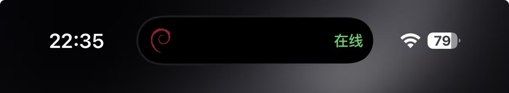

# Can You SSH From a Phone? iOS and Android Use Cases and Limits

Is SSH on a phone a fake need?

If you want to write shell scripts, scroll through hundreds of log lines, or edit a large config in Vim on a phone, it is genuinely painful. The screen is small, there is no physical keyboard, and many things that feel natural on a computer become awkward.

But the value of mobile SSH was never to replace the computer.

It is 11 p.m. and you are out at dinner when someone in the group chat says the service is down. The monitoring page already shows CPU going red and the alert text is clear — but all they tell you is that something broke.

Next, you still have to get into the server: check the service status, read a few log lines, find the container that exited, restart it, and confirm the service has actually recovered.

That is what mobile SSH is for.

Not doing a full day's work on a phone, but handling the problem in front of you when the computer is not nearby.

The point of mobile SSH is not to enable working from anywhere at all hours. It is to keep a problem that takes a few minutes from getting stuck at "wait until I find a computer."

## The Termark mobile app did not start from the phone

Termark began as a desktop app.

The desktop app today is also far more than a host list with a black terminal. It manages SSH, Telnet, serial, local terminals, and NextTerminal assets in one place, with tabs, split panes, terminal search, auto reconnect, command snippets, keyword highlighting, SFTP, port forwarding, session replay, and batch execution across machines.

Credentials, jump hosts, proxies, sync, and the AI assistant all work against the same set of server assets.

The desktop solves remote work that repeats every day, but this workflow always lacked one entry point:

**What do you do when you are not at the computer?**

So I built the mobile app not to cram all of operations into a phone, and not to pivot into some "mobile ops" market. It is more like a hand reaching out from the desktop.

Complex configs, batch operations, and long investigations stay on the computer; checking status, reading a few log lines, restarting a service, downloading a file — those quick jobs are caught by the phone.

Both ends see the same servers, the same credentials, and the same working context — not two unrelated products.

## Showing only CPU and memory is not real operations tooling

Many mobile server apps open on charts for CPU, memory, disk, and traffic. Rich colors, smooth animations, and it looks like a pocket operations center.

That data is useful, of course.

The question is what happens after you see CPU at 100%.

Or after you see that a container has exited?

If the next step is still "go back to the computer," it is a well-made dashboard, not a tool that actually handles the problem.

Termark mobile cares more about the step after the chart.

You can go straight into the terminal and run the command the situation needs, or open Docker management to view containers, Compose projects, images, volumes, and networks, and stop or restart the broken one.

For systemd services you can view status, start, stop, reload, enable at boot, and follow logs. When you need to download a log, replace a config, or move a file, SFTP is right there under the current host.

If something can be done with one tap, there is no need to type `docker restart` out on a soft keyboard; and for anything the UI does not cover, the terminal is still there.

Only with both of these together does a phone client become genuinely useful.

These features reuse the current SSH connection — they do not reconnect to the server every time you open a page. For operations that need `sudo` and cannot be elevated automatically in the current environment, Termark shows the corresponding command for you to confirm and run yourself, instead of leaving you with a bare "operation failed."

I also did not port the desktop's multi-machine batch execution to the phone.

It is hard to confirm a batch of target machines on a phone screen, and a single mis-tap can be costly. A phone is for handling the one machine in front of you first; batch work can wait until you are back at the computer.

## On a phone, AI is actually easier to put to work

When investigating logs on a computer, you can reach for `grep`, pipe things together, and open several windows.

On a phone, a screenful of output turns into mush quickly. Long-press, drag-select, copy, switch to a chat app, paste — none of it works well.

Termark's AI assistant can read the most recent terminal output directly. When you see an error, you can just ask:

"What is this problem?"

"What should I check next?"

"Generate the commands to investigate."

No need to assemble the context by hand first.

That said, whether AI actions need approval is decided by the Auto, Balanced, or Strict policy; the default Balanced mode runs clearly read-only commands automatically, while changes and unknown commands require approval.

A phone can be the emergency entry point, but control of the server should not be handed over just because the screen got smaller.

## Putting a terminal in a phone is not hard because of SSH

The SSH protocol itself is nothing mysterious.

The hard part is the mobile experience:

What do you do when the soft keyboard has no arrow keys?

You switch to WeChat to answer a message — is the session still there when you come back?

How do you switch between multiple terminals?

If the app goes to background and the connection drops, does the user find out in time?

Termark does not wrap a terminal in a web view. iOS renders with SwiftTerm and Android uses the Termux terminal engine, each rendering natively.

The underlying logic for SSH, SFTP, Docker, systemd, and AI reuses the same Go engine. The connection, encryption, and protocol compatibility problems already solved on the desktop do not need to be solved again on mobile.

Multiple terminal sessions can be switched directly. When a terminal is moved to a background tab it keeps receiving output; switching back requires no reload, and the previous scrollback is still there.

For the missing arrow keys on the soft keyboard, I ended up building a press-and-drag gesture.

Hold a finger on the terminal and push in a direction to send that arrow key; the farther you push, the faster the cursor moves — four speed levels, with haptic feedback.

For scrolling through history, moving the cursor, or editing a small piece of a command, it beats aiming at a few tiny on-screen arrow buttons.

Fonts could not be an afterthought either. The mobile app ships with a monospaced Nerd Font built in and lets users import their own. On import it checks that the font is actually monospaced, so tables, icons, and characters in the terminal do not end up misaligned.

## Android and iOS background capabilities are simply different

Background connections cannot be made identical on Android and iOS, and I am not going to pretend otherwise.

On Android, connecting to a server runs a foreground service with a persistent notification. Tapping the notification returns you to the current terminal, and the notification shows the current state when the connection drops or is reconnecting.

iOS does not allow apps to stay alive indefinitely in the background, so it cannot make the same promise as Android.

On iOS, Live Activities show the current host and session state on the lock screen and Dynamic Island, and tapping returns to the corresponding terminal. But after too long in the background, the connection can still be restricted by the system.

That limit cannot be waved away with "consistent experience across platforms."

For leaving a terminal running for hours, a computer is always the better fit.

## What you actually save is the time spent rebuilding your environment

The hardest part of logging in from a phone is usually not the terminal.

You may need to type the IP, dig through chat history for the password, figure out how to get a private key onto the phone, and only then remember this machine is only reachable through a jump host.

By the time all that is configured, you may have already found a computer.

Hosts, credentials, jump hosts, command snippets, and groups managed in the Termark desktop app can appear directly on the phone through cloud sync.

Sync supports the official service, WebDAV, S3, iCloud, and Git repositories. Data is encrypted on the client before upload; the storage side only receives ciphertext and cannot read your server information.

This step is what truly connects the desktop and the phone.

Server assets are organized on the computer during normal work, and complex work happens there too; when something breaks, pick up the phone, no environment setup needed — open the host and keep working.

## Who it fits, and who it does not

If you only log in to the occasional VPS, plenty of simple mobile terminals already do the job.

Termark mobile fits these situations better:

You manage multiple servers day to day;

You are on call or need to respond to alerts at any time;

You travel often but cannot fully step away from your servers;

You already maintain credentials, jump hosts, and host groups in the desktop app and do not want to set it all up again on a phone.

It does not use a few pretty charts to pretend it can replace a computer, and it does not encourage running your entire operations practice from a phone.

It just extends an already mature desktop workspace one step outward.

When an alert fires, computer nearby or not, there is at least one entry point that can actually get into the server, see the situation, and deal with it.

Termark mobile supports iOS and Android, and currently provides the terminal, SFTP, Docker, systemd management, AI assistance, and cloud sync. It fits better as an emergency entry point for a desktop workflow than as a computer replacement.

If you are choosing a tool that covers both desktop and mobile, see the [Termark cross-platform SSH client](https://www.termark.app/#download). If you care more about the boundaries of AI operating on servers, read [Termark AI assistant design](/blog/termark-ai-design).

**Need to handle a quick SSH task from a phone:** <a href="https://www.termark.app/?utm_source=docs&utm_medium=blog&utm_campaign=mobile_ssh_guide&utm_content=article_cta#download" data-umami-event="blog-cta-click" data-umami-event-campaign="mobile_ssh_guide" data-umami-event-destination="mobile-ssh-client">See Termark mobile and the download link</a>.

Website: [https://www.termark.app](https://www.termark.app)
