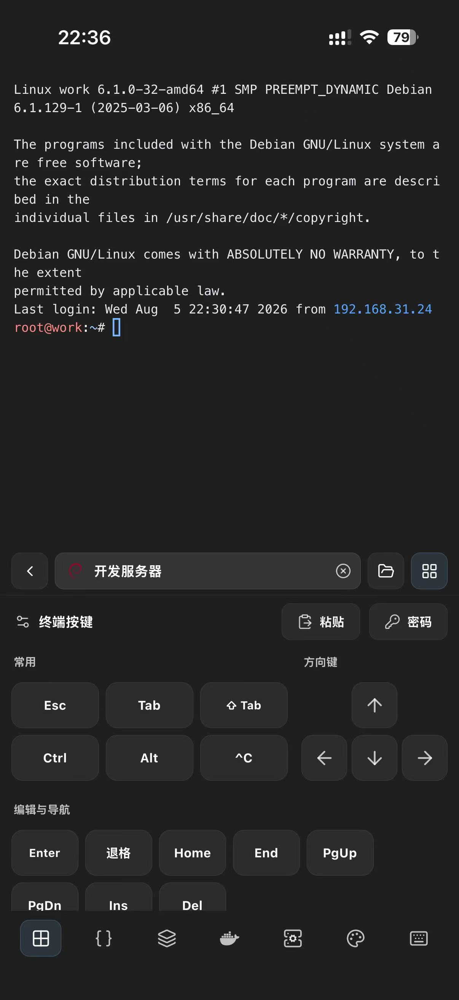
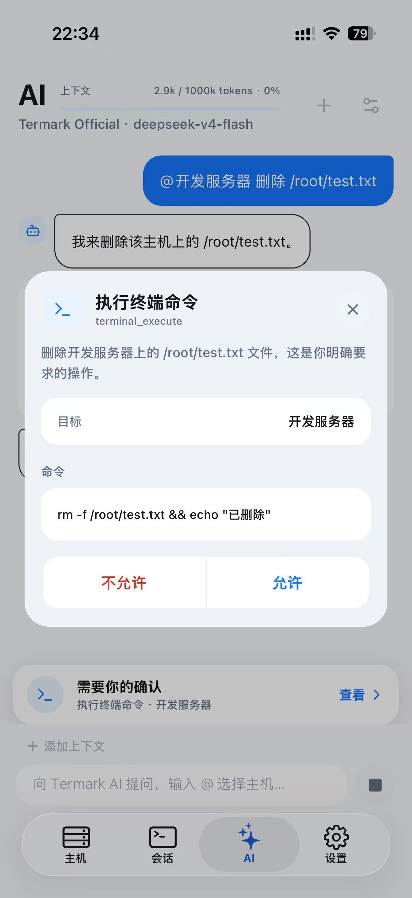

# 手机上可以 SSH 吗？iOS 与 Android 的适用场景和限制

手机 SSH 是不是伪需求？

要是在手机上写 Shell 脚本、盯几百行日志、用 Vim 改一大段配置，那确实挺折磨人的。屏幕太小，没有实体键盘，很多在电脑上顺手的操作，到了手机上都会变得别扭。

但手机 SSH 的价值，本来就不是替代电脑。

晚上十一点，你正在外面吃饭，群里突然有人说服务挂了。监控页面上的 CPU 已经飘红，告警消息也写得很清楚，可它们只能告诉你：出事了。

接下来，你还是得进入服务器，看看服务状态，翻几行日志，找到退出的容器，重启，再确认业务真的恢复了。

这才是我理解的手机 SSH。

不是拿手机干一天的活，而是在电脑不在身边的时候，先把眼前的问题处理掉。

手机 SSH 的价值，不是让人随时随地加班，而是别让一个原本几分钟能解决的问题，卡在“等我找到电脑”这一步。

## Termark 移动端，并不是从手机开始的

Termark 最早做的是桌面端。

现在的桌面端也早已不只是一个主机列表加黑色终端框。它可以统一管理 SSH、Telnet、串口、本地终端和 NextTerminal 资产，支持多标签、分屏、终端搜索、自动重连、命令片段、关键字高亮、SFTP、端口转发、会话回放和多机批量执行。

凭证、跳板机、代理、同步和 AI 助手，也都围绕同一份服务器资产工作。

桌面端解决的是每天反复发生的远程工作，但这套工作流一直缺少一个入口：

**人不在电脑前时怎么办？**

所以我做移动端，并不是想把所有运维工作塞进手机，也不是突然转向所谓的“手机运维”赛道。

它更像是桌面端向外延伸的一只手。

复杂配置、批量操作和长时间排查，依然留在电脑上；查看状态、读几行日志、重启服务、下载一个文件，这些临时操作由手机接住。

两端看到的不是两套互不相干的产品，而是同一批服务器、同一套凭证和同一个工作现场。

## 只展示 CPU 和内存，还不算真正的运维工具

很多移动服务器 App，首页都会放上 CPU、内存、磁盘和流量图表。颜色丰富，动画也很漂亮，看起来像一个随身运维中心。

这些数据当然有用。

问题是，看到 CPU 100% 之后呢？

看到某个容器退出之后呢？

如果下一步还是“回去找电脑”，那它更像一块做得不错的仪表盘，而不是一个真正能处理问题的工具。

Termark 移动端更在意图表后面的那一步。

你可以直接进入终端，执行现场需要的命令；也可以打开 Docker 管理，查看容器、Compose 项目、镜像、卷和网络，启停或重启出问题的容器。

systemd 服务可以查看状态、启动、停止、重载、设置自启和跟踪日志。需要下载日志、替换配置或者传文件时，当前主机下面就有 SFTP。

能点一下完成的事情，没必要在软键盘上硬敲一遍 `docker restart`；界面没有覆盖到的操作，终端依然在那里。

这两种方式放在一起，手机端才真正有用。

这些功能会复用当前的 SSH 连接，不会每打开一个页面就重新连接一次服务器。遇到需要 `sudo`、当前环境又不能自动提权的操作，Termark 会把对应命令展示出来，让用户自己确认和执行，而不是只留下一句“操作失败”。

我也没有把桌面端的多机批量执行照搬到手机上。

手机屏幕很难同时确认一批目标机器，误点一次的代价又可能很高。手机适合先处理眼前这一台，批量操作等回到电脑前再做。

## AI 在手机上，反而更容易派上用场

在电脑上排查日志，可以随手使用 `grep`、接管道、多开几个窗口。

手机上一屏输出挤在一起，很快就看乱了。长按、拖选、复制，再切到聊天软件粘贴，也并不好用。

Termark 的 AI 助手可以直接读取当前终端最近的输出。看到一段报错时，可以直接问：

“这是什么问题？”

“下一步应该查什么？”

“帮我生成排查命令。”

不需要先手动整理上下文。

不过，AI 要执行命令时，仍然会先展示完整命令，等用户确认后再运行。

手机可以成为应急入口，但服务器的控制权不能因为屏幕变小了，就顺手一起交出去。

## 把终端放进手机，难的不是连上 SSH

SSH 协议本身并不神秘。

真正麻烦的是移动端的使用体验：

软键盘没有方向键怎么办？

切到微信回复一条消息，再回来时会话还在不在？

多个终端怎么切换？

App 进入后台后，连接断了，用户能不能及时知道？

Termark 没有使用网页或 WebView 套一个终端。iOS 使用 SwiftTerm，Android 使用 Termux 的终端引擎，分别进行原生渲染。

SSH、SFTP、Docker、systemd 和 AI 的底层逻辑，则复用同一个 Go 引擎。桌面端已经处理过的连接、加密和协议兼容问题，移动端不需要重新踩一遍。

多个终端会话可以直接切换。终端被放到后台页面时，仍然会继续接收输出；再次切回来，不需要重新加载，之前的滚动记录也还在。

软键盘没有方向键的问题，我最后做成了长按方向手势。

手指按住终端，向哪个方向推动，就发送哪个方向键；推动距离越远，移动速度越快，一共分为四档，同时配有触感反馈。

翻历史记录、移动光标或者修改一小段命令时，它比在软键盘上瞄几个很小的方向按钮舒服得多。

字体也不能随便塞一个进去。移动端内置了等宽 Nerd Font，同时允许用户导入自己的字体。导入时会检查字体是否真的等宽，避免终端中的表格、图标和字符全部错位。

## Android 和 iOS 的后台能力，本来就不一样

后台连接这件事，Android 和 iOS 很难做到完全一致，我也不打算假装它们一样。

Android 连接服务器时会运行前台服务，并显示常驻通知。点击通知可以直接回到当前终端；连接断开或者正在重连时，通知也会展示当前状态。

iOS 不允许 App 在后台长期保活，所以无法给出和 Android 一样的承诺。

iOS 端会通过实时活动，在锁屏和灵动岛上展示当前主机及会话状态，点击后可以返回对应终端。但进入后台时间过长后，连接仍然可能受到系统限制。

这个限制不是一句“全平台体验一致”就能绕过去的。

真要挂着终端跑几个小时，电脑永远更合适。

## 真正节省的，是重新准备环境的时间

临时用手机登录服务器，最麻烦的往往不是终端本身。

你可能需要先输入 IP，再翻聊天记录找密码，然后想办法把私钥传到手机上，最后才想起来这台机器还必须经过跳板机。

等这些东西配置完，电脑可能都已经找到了。

Termark 桌面端管理好的主机、凭证、跳板机、命令片段和分组，可以通过云同步直接出现在手机上。

同步支持官方服务、WebDAV、S3、iCloud 和 Git 仓库。数据会在客户端完成加密后再上传，存储端拿到的是密文，无法直接看到服务器信息。

这一步才真正把桌面端和移动端连接起来。

服务器资产平时在电脑上整理，复杂工作也在电脑上完成；需要应急时拿起手机，不需要重新准备环境，打开对应主机就能继续处理。

## 它适合谁，又不适合谁

如果只是偶尔登录一台 VPS，市面上很多简单的移动终端都已经够用。

Termark 移动端更适合这些场景：

平时就在管理多台服务器；

需要值班或者随时响应告警；

经常出差，又不能完全离开服务器；

已经在桌面端维护了凭证、跳板机和主机分组，不想在手机上重新配置一遍。

它不会用几张漂亮图表假装自己可以替代电脑，也不会鼓励用户在手机上完成整套运维工作。

它只是把已经成熟的桌面工作台向外延伸了一步。

当告警响起时，不管电脑在不在身边，至少还有一个真的能够进入服务器、查看现场并处理问题的入口。

Termark 移动端支持 iOS 和 Android，目前已经提供终端、SFTP、Docker、systemd 管理、AI 辅助和云同步等功能。它更适合作为桌面工作流的应急入口，而不是替代电脑。

如果你正在选择同时覆盖桌面与移动端的工具，可以继续查看 [Termark 跨平台 SSH 客户端](https://www.termark.app/zh-cn/ssh-client/)；如果更关心 AI 在服务器上的操作边界，可阅读 [Termark AI 助手设计](./termark-ai-design)。

官网：[https://www.termark.app/zh-cn/](https://www.termark.app/zh-cn/)
