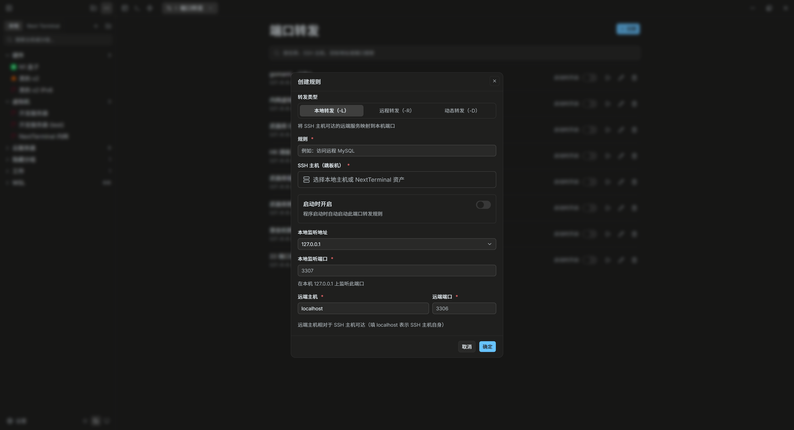
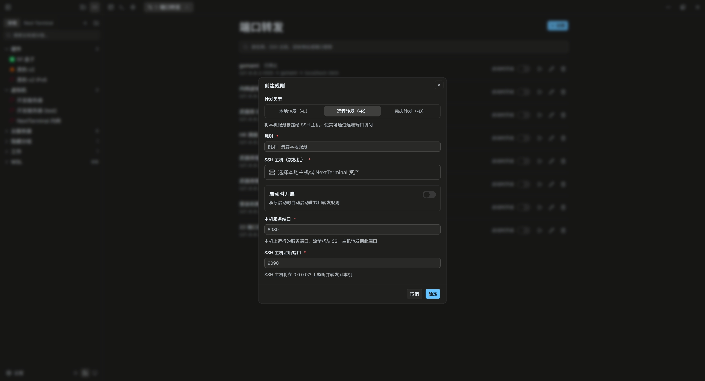
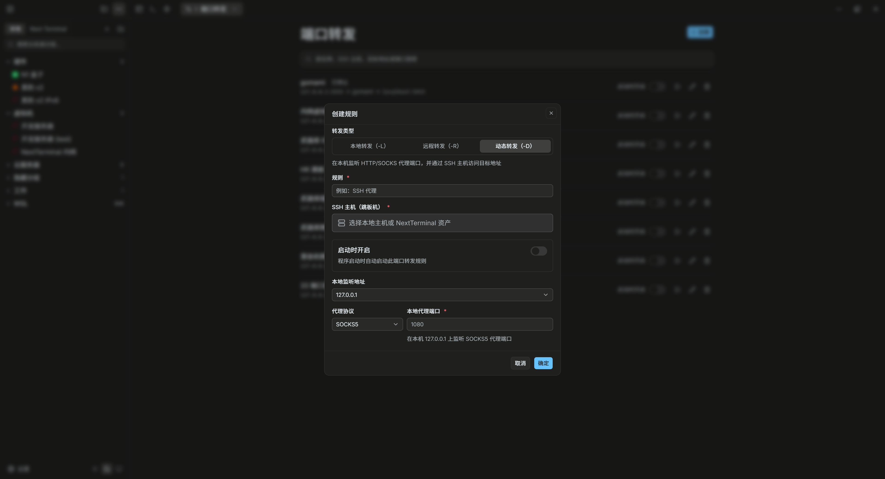

# SSH 端口转发怎么用？

SSH 端口转发把 TCP 流量放进加密连接。三种模式最容易混淆：

- `-L`：在本机监听，访问 SSH 主机可达的服务；
- `-R`：在 SSH 主机一侧监听，把流量带回本机；
- `-D`：在本机建立 SOCKS 代理，由客户端为每个请求指定目标。

## 本地转发 `-L`

```bash
ssh -L 127.0.0.1:3307:localhost:3306 user@bastion.example.com
```

本机程序连接 `127.0.0.1:3307`，流量经 SSH 到达“从 SSH 主机视角”的 `localhost:3306`。常见用途是访问内网数据库或管理页面。



*本地转发配置示例：规则尚未选择 SSH 主机，不代表隧道已经启动。*

默认绑定 `127.0.0.1` 通常更安全。绑定 `0.0.0.0` 会让同网段甚至更广范围的设备尝试连接，必须配合防火墙和认证评估。

## 远程转发 `-R`

```bash
ssh -R 127.0.0.1:9090:localhost:8080 user@bastion.example.com
```

SSH 服务器一侧监听 9090，并把连接带回本机 8080。它适合临时让远端环境访问本机开发服务。



*远程转发能否对其他机器开放，取决于 sshd 的 GatewayPorts、监听地址和防火墙。*

不要因为表单显示 `0.0.0.0` 就假定公网一定可访问。服务器配置可能强制回环监听，也可能禁止远程转发。

## 动态转发 `-D`

```bash
ssh -D 127.0.0.1:1080 user@bastion.example.com
```

本机得到一个 SOCKS 代理。支持 SOCKS5 的浏览器或工具连接 `127.0.0.1:1080`，再按请求访问不同目标。



*动态转发不是固定端口映射；目标由 SOCKS 客户端请求决定。*

注意 DNS 是否通过代理解析。若应用先在本地解析域名，仍可能泄露查询或得到不可达的内网地址。

## 如何验证隧道

本地查看监听：

```bash
ss -lntp
```

测试本地转发：

```bash
curl http://127.0.0.1:3307
```

测试 SOCKS：

```bash
curl --socks5-hostname 127.0.0.1:1080 https://example.com/
```

远程转发还应登录 SSH 主机检查监听地址，并结合防火墙规则判断可达范围。

## 常见故障

### Address already in use

监听端口已被占用。使用 `ss -lntp` 找到进程，或改用未占用端口。

### administratively prohibited

服务器可能关闭转发或限制目标。检查 `AllowTcpForwarding`、`PermitOpen` 等策略，不要通过绕过安全策略解决。

### 远程端口只能本机访问

检查 `GatewayPorts`、绑定地址和防火墙。开放到 `0.0.0.0` 前先评估服务自身认证。

### 能连端口但服务不响应

目标地址从哪一端解析经常被理解错。`-L` 的目标由 SSH 主机访问；`-R` 的目标通常由本机访问。

## 安全清单

- [ ] 能否只绑定 `127.0.0.1`？
- [ ] 目标服务是否有自己的认证？
- [ ] 规则是否会在应用启动时自动开放？
- [ ] SSH 断线后监听是否关闭？
- [ ] 是否能看到活动连接？
- [ ] 是否记录了规则用途、负责人和有效期？
- [ ] 动态代理的 DNS 是否按预期走隧道？

Termark 可保存本地、远程和动态转发规则；具体行为以当前版本和[更新日志](/zh/changelog)为准。

**用 Termark 管理 SSH 端口转发：**<a href="https://www.termark.app/zh-cn/?utm_source=docs&utm_medium=blog&utm_campaign=ssh_port_forwarding_guide&utm_content=article_cta#download" data-umami-event="blog-cta-click" data-umami-event-campaign="ssh_port_forwarding_guide" data-umami-event-destination="ssh-client">查看跨平台 SSH 客户端</a>。
