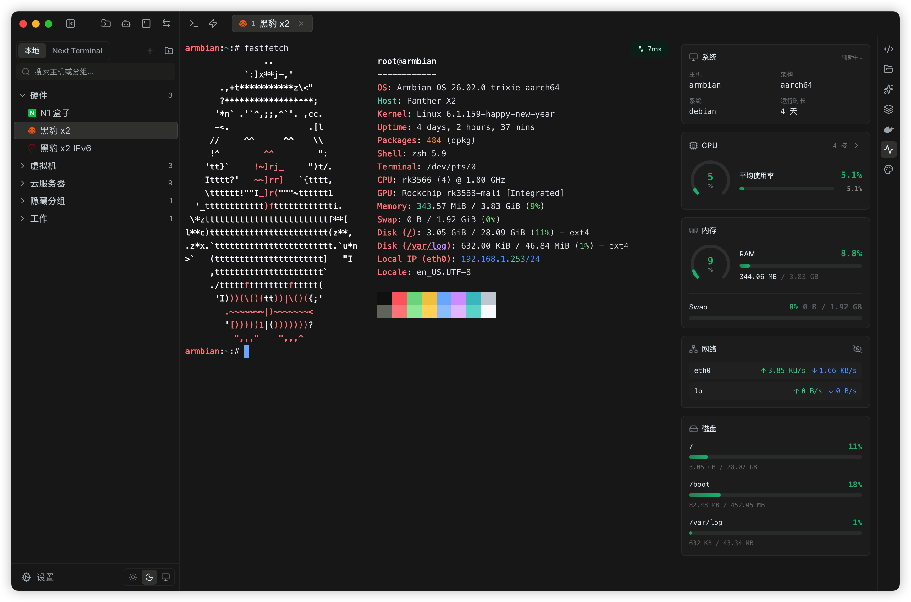

# 有了 Xshell、MobaXterm、Termius，为什么我还要做 Termark？

做 Termark 之后，经常有人问我：

SSH 工具已经这么多了，Xshell、MobaXterm、Termius、SecureCRT 都很成熟，为什么还要再做一个？

这个问题我觉得应该认真回答。

我做 Termark，不是因为这些老牌工具不好。恰恰相反，它们都很强。

Xshell 和 SecureCRT 更像专业终端客户端，强在稳定连接、终端仿真、会话管理和复杂环境兼容。MobaXterm 更像一个 Windows 上的远程工具箱，把 SSH、SFTP、X11、RDP、VNC、隧道和很多常用工具放在一起。Termius 则更偏现代化体验，多端同步、团队协作、密钥管理和移动端都做得比较靠前。

这些路线都成立。

但我觉得，服务器工作这件事本身变了。今天的问题不只是“怎么连上服务器”，而是连上之后，能不能更顺手地完成一整套远程工作。

## 问题不只是连接，而是资产和工作流

如果只有一两台服务器，用系统终端加 `~/.ssh/config` 也能过得去。

但机器一多，麻烦就来了：

哪台是生产？哪台是测试？哪台要走跳板？哪台只能通过代理访问？哪些命令可以在生产跑？哪几台机器要一起检查磁盘、服务状态和版本？公司电脑、家里电脑、笔记本之间，资产和命令片段怎么同步？

这时候，问题已经从“连接管理”变成了“资产管理”。

一台服务器不只是一个 IP。它有环境、分组、凭证、代理、跳板、标签、命令片段、SFTP、端口转发规则、历史会话和 AI 上下文，也可能来自 Next Terminal 这样的团队资产系统。

Termark 想做的，就是围绕服务器资产，把这些日常动作放到同一个桌面工作流里。

## 我不想做一个“功能更多的 MobaXterm”

做工具软件很容易掉进功能清单陷阱。

别人有 X11，我也要有；别人有 RDP，我也要有；别人有宏录制，我也要有；别人有脚本系统，我也要有。最后功能越来越多，主线越来越模糊。

Termark 不想走这条路。

我更关心的是，一个经常连服务器的人，每天最容易被哪些事情打断：

为了传一个文件，切到另一个 SFTP 工具。  
为了开一个端口转发，去翻以前写过的 `ssh -L` 命令。  
为了找某台机器，在一堆会话里凭名字猜。  
为了重复执行一条巡检命令，开多个窗口逐个粘贴。  
为了让 AI 分析报错，手动复制一大段终端输出到聊天窗口。  
为了在另一台电脑上使用同样的资产和命令片段，又导出导入一次配置。

这些问题单独看都不大，但每天遇到，就会变成真实的摩擦。

所以 Termark 的目标不是“更多功能”，而是“更少断点”。

## Termark 的中心不是终端，而是远程工作流

终端当然很重要。SSH 工具如果连终端都不稳定，后面讲什么都没意义。

但真实工作不会停在终端里。

你进入一台机器之后，可能要打开 SFTP 下载日志，可能要启动端口转发访问内网服务，可能要保存一条刚验证过的命令，可能要把相同命令发到另一组机器，也可能要让 AI 根据最近的终端输出给出排查建议。

如果这些动作每次都从零开始，工具就只是“能用”。

如果它们共享同一个资产上下文，体验就会顺很多。

所以 Termark 现在的核心能力可以概括成几件事：

- 用资产树组织服务器，而不是只保存一批连接。
- 在同一个资产上下文里使用终端、SFTP、端口转发和命令片段。
- 支持多台机器批量执行命令，减少重复粘贴。
- 支持多设备同步，让资产、凭证、配置和命令片段可以跟着用户走。
- 接入 AI 辅助，但保留命令执行确认和风险边界。

Termark 目前提供 iOS 和 Android Beta。移动端解决的是告警响应与临时操作等入口覆盖问题，桌面端仍然承担高频、多窗口和长时间工作的主流程。

## 本地客户端和 Web SSH 不是二选一

这个问题对我来说比较特殊，因为 Next Terminal 堡垒机（支持 Web SSH）也是我做的。

我对这两个产品的理解很简单：

Next Terminal 更适合作为团队资产掌控的入口。服务器资产由管理员统一维护，权限由管理员分配，用户按授权连接即可。对团队来说，重要的是可管控、可审计、可追溯。

堡垒机可以记录用户和 AI 的会话内容，可以回放，也可以做高危命令拦截。管理员关心的是：谁在什么时候连了哪台机器，执行过什么操作，有没有触碰高风险命令，出了问题能不能追溯。

Termark 解决的是另一层：个人桌面上的高频远程操作。

一个偏组织视角，一个偏个人工作流视角。它们可以连接起来，而不是互相替代。

## 当前的平台支持

桌面端当前提供 Windows x64/ARM64、macOS 和 Linux 安装包；移动端提供 iOS 与 Android Beta。不同平台的安装格式、架构和版本节奏可能不同，请以[官网下载页](https://www.termark.app/#download)和[更新日志](https://docs.termark.app/zh/changelog)为准。

对桌面工具来说，安装、更新、平台适配和稳定迭代不如新功能显眼，却会直接影响日常使用。
