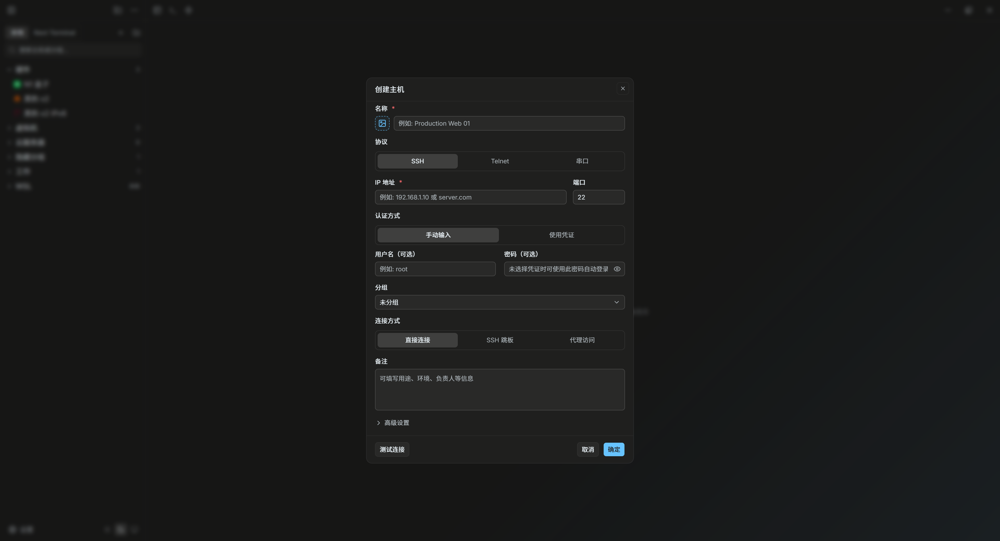

# Windows 上怎么选 SSH 客户端？

在 Windows 上搜索 SSH 客户端，通常会看到 OpenSSH、PuTTY、Xshell、MobaXterm、Tabby、Termius 等名字。它们没有简单的高低之分，差别主要在于：你只是偶尔连一台 Linux，还是每天管理一批服务器。

先给一个不绕弯的判断：

- **偶尔连接一两台服务器**：Windows 自带 OpenSSH 或 PuTTY 通常够用。
- **需要完整的远程工具箱**：可以看 MobaXterm 一类集成 SSH、SFTP、X11、RDP 的工具。
- **每天管理多台服务器**：重点看资产分组、凭据、跳板机、SFTP、端口转发和会话恢复。
- **想把 AI 放进服务器工作流**：重点不是“能不能生成命令”，而是变更命令是否必须确认。

## Windows 自带 OpenSSH：最简单，也最容易脚本化

较新的 Windows 系统通常可以直接使用 `ssh`、`scp` 和 `sftp`。最小工作流很直接：

```powershell
ssh user@example.com
scp .\config.yaml user@example.com:/tmp/
sftp user@example.com
```

配合 `C:\Users\你的用户名\.ssh\config`，可以保存主机别名、端口、IdentityFile 和 ProxyJump。对于熟悉命令行的人，OpenSSH 的优点是透明、可脚本化、容易放进 PowerShell 或 CI 流程。

它的不足也很明确：资产分组、图形化 SFTP、会话记录、批量输出和跨设备同步需要你自己组合其他工具。机器少时这不是问题，机器多了以后，维护成本会转移到配置文件、脚本和笔记里。

## PuTTY：轻量，但工作流比较分散

PuTTY 在 Windows SSH 工具里很经典。它启动快、体积小，保存会话也很方便，适合只需要一个稳定终端窗口的用户。

但如果你的工作包含下面这些动作，就要额外确认配套工具和使用方式：

- SFTP 文件传输；
- 多标签和分屏；
- 端口转发规则管理；
- 多台服务器批量查看；
- 私钥格式与其他 OpenSSH 工具的兼容；
- 资产、凭据和跳板机配置的统一管理。

PuTTY 没有问题，只是它更像一个轻量连接工具，不一定适合作为完整服务器工作台。

## MobaXterm 和 Xshell：适合不同的 Windows 用户

MobaXterm 更像远程工具箱，除了 SSH 和 SFTP，还可能覆盖 X11、RDP、VNC、隧道等场景。如果你经常在 Windows 上连接不同类型的远程环境，集成度是它的优势。

Xshell 更偏终端客户端和会话管理。对重视终端仿真、标签页、会话配置和稳定连接的用户，它是一条成熟路线。

比较这类工具时，不要只看功能清单。最好拿自己的任务测试：

1. 导入一份现有 SSH 配置；
2. 连接一台需要跳板机的内网主机；
3. 在终端旁打开 SFTP 并上传日志；
4. 保存一个本地端口转发规则；
5. 断网后恢复会话；
6. 从 PowerShell 复制一段中文和多行命令。

能否稳定完成这些任务，比首页上多出几个图标更有参考价值。

## 图形化 SSH 工作台适合什么场景

当服务器数量增加后，问题往往不是“怎么输入 ssh 命令”，而是“怎么不连错机器”。一个更完整的 Windows SSH 工作流通常需要：

- 生产、测试、客户项目等多级资产分组；
- 搜索主机、标签和备注；
- 绑定账号、密码、私钥、跳板机和代理；
- 记录当前目录和常用命令片段；
- 同时打开多个标签或分屏；
- 在同一个服务器上下文里使用 SFTP；
- 保存端口转发规则；
- 批量执行时分别查看每台机器的输出；
- 在另一台电脑上同步经过加密的数据。

这类工具的价值不是把命令行藏起来，而是减少重复配置和窗口切换。终端仍然应该是完整的终端，而不是只能点击几个预设按钮。



*在 Windows 版 Termark 中创建 SSH 主机：可选择手动输入或已保存凭证，并配置直接连接、SSH 跳板或代理。*

## Windows 版要特别检查的五件事

### 1. 安装版和便携版

如果你需要在不同电脑之间携带工具，先确认便携版的数据目录、升级方式和解锁方式。不要默认“复制整个文件夹”就等于安全迁移，尤其是里面包含密码和私钥时。

### 2. 安全软件误报

网络工具有时会触发安全软件的启发式检测。产品应该提供版本说明、签名信息和误报处理文档，而不是只告诉用户“关闭杀毒软件”。Termark 的 Windows 误报说明见[中文文档](https://docs.termark.app/zh/usage/windows-virus-warning)。

### 3. PowerShell、WSL 和普通 SSH

Windows 用户可能同时使用 PowerShell、CMD、WSL 和远程 Linux shell。测试复制粘贴、路径格式、环境变量和快捷键是否互相干扰。需要本地终端时，最好能在同一资产树里区分本地与远程会话。

### 4. 私钥与代理配置

确认工具支持你的私钥格式、私钥口令、SSH Agent、HTTP/SOCKS5 代理和多级跳板。只支持“用户名 + 密码”的工具，很快会遇到边界。

### 5. x64 与 ARM64

Windows 不只运行在传统 x64 电脑上。Surface、开发板和部分新设备可能使用 ARM64。下载时确认安装包架构，避免装上后才发现性能或兼容性问题。

## SFTP 是否应该单独使用

如果你只是偶尔上传一个文件，`scp` 或一个独立 SFTP 工具已经够用。如果经常在排查问题时上传配置、下载日志、编辑远程文件，终端与 SFTP 共享上下文会更顺手：

- 终端切到 `/var/log`，SFTP 可以跟随当前目录；
- 不需要重新选择主机和凭据；
- 可以在同一会话旁查看传输状态；
- 文件操作和终端排查不容易分成两个孤立窗口。

Termark 的 [Windows SSH 客户端页面](https://www.termark.app/zh-cn/windows-ssh-client/)和 [SFTP 客户端页面](https://www.termark.app/zh-cn/sftp-client/)展示了这类工作流；具体的目录跟随配置见[中文文档](https://docs.termark.app/zh/usage/sftp-cwd-tracking)。

## AI SSH：先看确认机制

Windows 上的 AI SSH 工具越来越多，但“可以调用模型”不等于适合连接生产服务器。至少要确认：

- 最近哪些终端输出会发送给模型；
- API Key 如何保存；
- 是否支持自己的模型和接口；
- 生成的完整命令是否能在执行前查看；
- 删除、写入、安装、重启和权限变更是否需要确认；
- AI 是否使用当前 SSH 用户、目录和会话，而不是偷偷另开一个环境。

Termark 的 AI 助手会把可能改变服务器状态的命令展示出来，等待用户确认。可以查看 [AI SSH 客户端](https://www.termark.app/zh-cn/ai-ssh-client/)和 [AI SSH 安全边界文章](./termark-ai-design)。

## 一份 Windows SSH 客户端选择清单

- [ ] 我只需要单机连接，还是需要多级资产管理？
- [ ] 是否支持 PowerShell、WSL 和普通远程 shell 的日常复制粘贴？
- [ ] 是否支持密码、私钥、SSH Agent、keyboard-interactive？
- [ ] 是否支持 ProxyJump、HTTP 代理和 SOCKS5 代理？
- [ ] 是否包含 SFTP，且能和终端共享主机上下文？
- [ ] 是否能保存本地和远程端口转发规则？
- [ ] 批量执行是否单独显示每台机器的输出？
- [ ] 凭据是否明文保存在配置目录？
- [ ] 便携版迁移到另一台电脑时如何解锁？
- [ ] 是否有 x64、ARM64 和清楚的安装包说明？
- [ ] AI 生成变更命令时是否要求确认？
- [ ] 文档、更新日志和反馈入口是否真实可用？

## Termark 适合什么情况

Termark 更适合在 Windows 上经常管理多台服务器，同时需要终端、SFTP、资产、端口转发、命令片段、加密同步和受控 AI 的用户。核心 SSH、SFTP、端口转发、AI 辅助和本地加密能力属于 Free 计划；批量执行、云同步和其他进阶能力属于 PRO，具体以[下载页](https://www.termark.app/zh-cn/windows-ssh-client/)当前说明为准。

**用 Termark 试试这套 Windows SSH 工作流：**<a href="https://www.termark.app/zh-cn/windows-ssh-client/?utm_source=docs&utm_medium=blog&utm_campaign=windows_ssh_guide&utm_content=article_cta" data-umami-event="blog-cta-click" data-umami-event-campaign="windows_ssh_guide" data-umami-event-destination="windows-ssh-client">查看 Windows 客户端与下载入口</a>。

如果你只偶尔连一台主机，Windows 自带 OpenSSH 已经是很好的起点。如果你每天都在多个服务器、文件传输和连接配置之间来回切换，再试一个完整工作台，比较它能否减少你的实际操作步骤。
